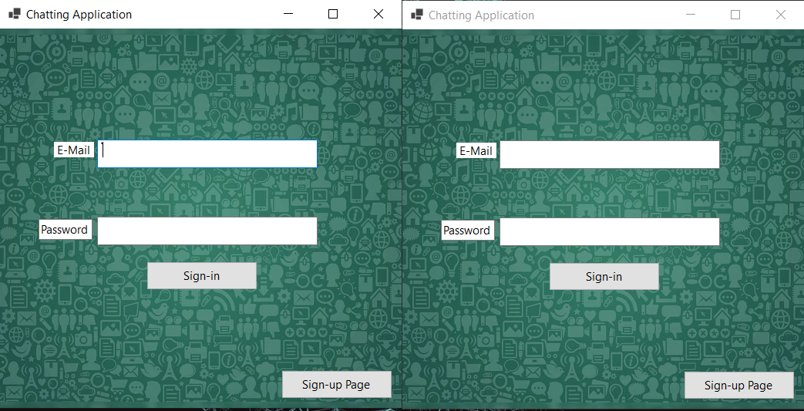

# RealTime-Chatting-Application-
Chatting App is a simple UDP-based chat application developed in C# & MS SQL Server. It allows clients to send and receive messages over a network. with the use of asynchronous communication with Multi-Threading & UDP Client in Windows Forms.

## ChattingApp

ChattingApp is a simple UDP-based chat application developed in C#. It allows clients to send and receive messages over a network. This is a basic implementation for learning purposes, demonstrating the use of asynchronous communication with `UdpClient` in Windows Forms.
### ScreenShots

### Features

- **Asynchronous Communication**: Uses `BeginReceive` and `EndReceive` for non-blocking message handling.
- **Simple UI**: A basic Windows Forms interface with controls for entering the remote IP address, sending messages, and displaying received messages.
- **Cross-Thread UI Updates**: Ensures safe updates to the UI from asynchronous callbacks.

### Usage

1. Clone the repository.
2. Open the solution in Visual Studio.
3. Run the application.
5. Click `Connect` to begin listening for messages.
6. Type a message and click "Send" to transmit the message to the remote client.

### Requirements

- .NET Framework
- Visual Studio

### Code Structure

- **Form1.cs**: Contains the main logic for the UDP chat application.
- **Program.cs**: Entry point of the application.
- **Designer Files**: Auto-generated files for the Windows Forms designer.

### License

This project is licensed under the MIT License.

---
